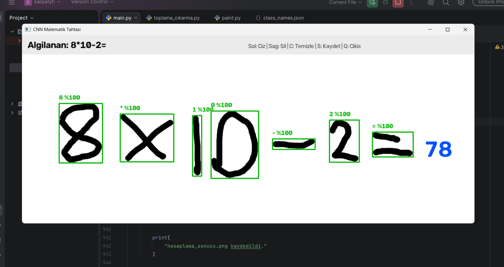

# CNN Handwritten Calculator

A CNN-based application that recognizes and solves handwritten arithmetic expressions in real time using TensorFlow and OpenCV.



## Features

- Handwritten digit recognition
- Addition, subtraction, multiplication and division
- Multiple-digit number support
- Real-time OpenCV drawing board
- Automatic calculation after drawing the equals sign
- CNN-based symbol classification

## Supported Symbols

```text
0 1 2 3 4 5 6 7 8 9
+ - × ÷ =
```

## Installation

Clone the repository:

```bash
git clone https://github.com/ali-celenoglu/CNN-Handwritten-Calculator.git
cd CNN-Handwritten-Calculator
```

Install the required libraries:

```bash
pip install -r requirements.txt
```

## Usage

Run the application:

```bash
python main.py
```

### Controls

- Left mouse button: Draw
- Right mouse button: Erase
- `C`: Clear the drawing board
- `S`: Save the current result
- `Q`: Quit

Write an expression such as:

```text
12 + 3 =
```

The application recognizes the symbols and displays the result to the right of the equals sign.

## Project Files

```text
CNN-Handwritten-Calculator/
├── main.py
├── math_symbols_cnn.keras
├── class_names.json
├── image.png
├── requirements.txt
├── LICENSE
└── README.md
```

## Technologies

- Python
- TensorFlow / Keras
- OpenCV
- NumPy

## License

This project is licensed under the MIT License.
